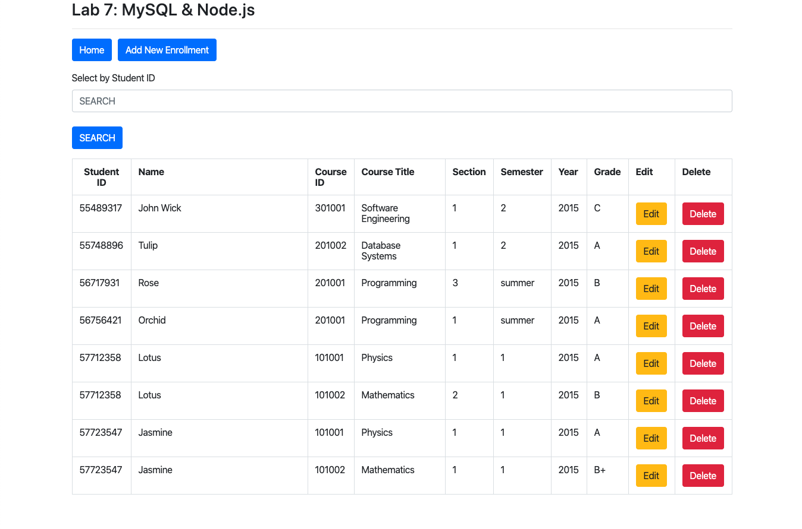
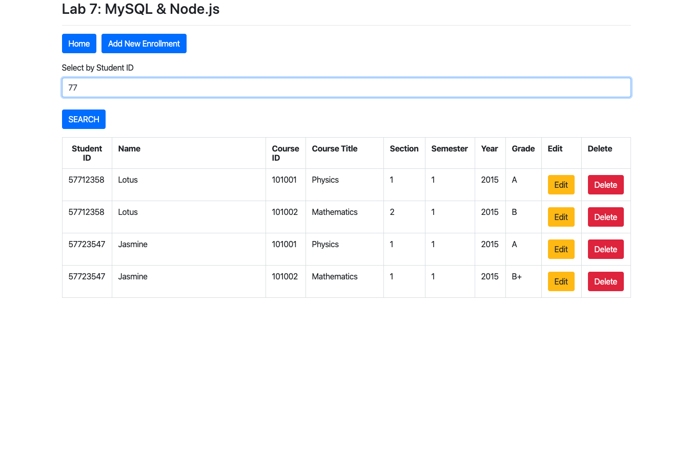
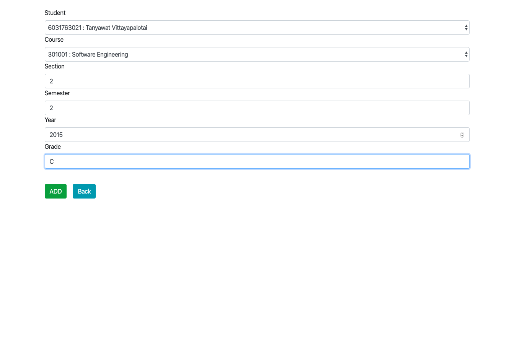
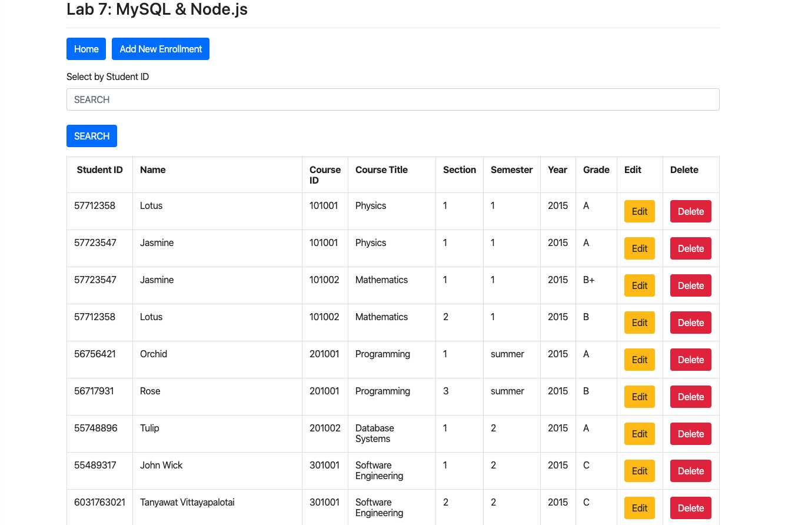
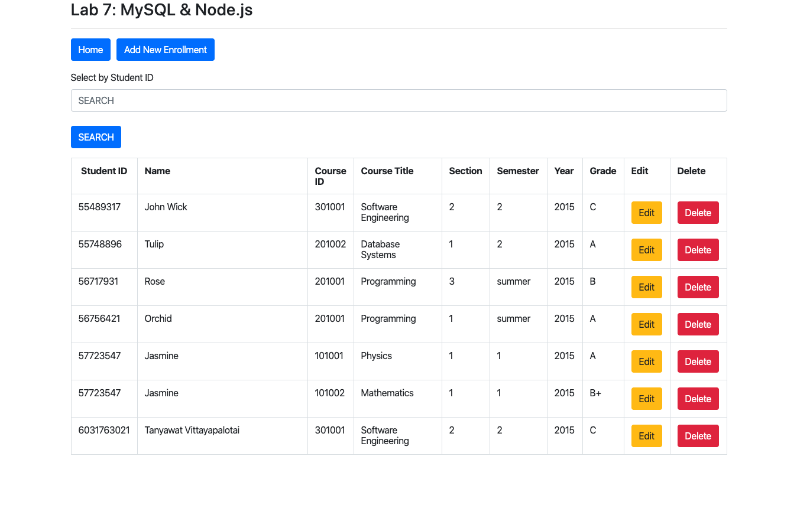
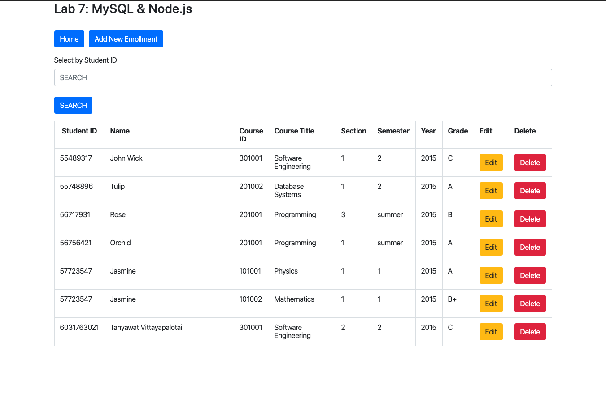

# Database Systems Laboratory Lab 7 : MySQL & Node.js

Tanyawat Vittayapalotai 6031763021

## Question 4:

Edit files server.js, index.pug, edit.pug,and add.pug to show, search, insert, edit,and delete the datarecordsin the Takes table (Student ID, course id, sect_id, semester, year, and grade).Complete tasks 4.1 – 4.5, then capture all screenshots and submit them through myCourseVille.

### Question 4.1 List:

Show all student enrollments

### Question 4.2 Search:

Search with the keyword "77"

### Question 4.3 Add:

Insert your enrollment information with your studentID and the following information

- **CourseID** : 301001
- **SectionID** : 2
- **Semester** : 2
- **Year** : 2015
- **Grade** : C

After Insertion

### Question 4.4 Edit:

Edit student enrrollment information **by updating the section code from '1' to '2' of studentID 55489317**

### Question 4.5 Delete:

Delete student's enrollment information of student ID 55712358

## Appendix : Source Code

Full source code is uploaded at github repository [hamzaabamboo/2190462-Database-System-Laboratory](https://github.com/hamzaabamboo/2190462-Database-System-Laboratory) at directory [labs/lab_3/web](https://github.com/hamzaabamboo/2190462-Database-System-Laboratory/tree/master/labs/lab_3/web)
