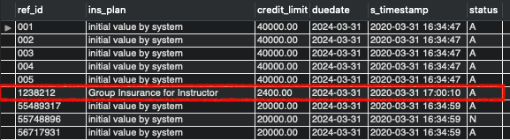
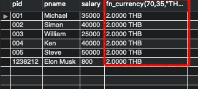
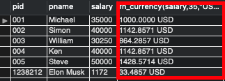
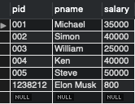
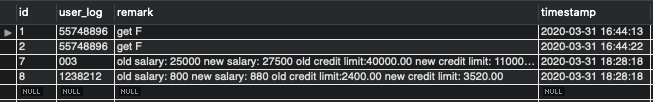
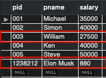
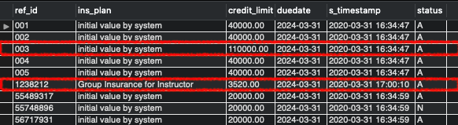

# Database Systems Laboratory Lab 8 : Database Programming

Tanyawat Vittayapalotai 6031763021

## Question 1

Each insertion of professor information, the data are inserted into not only `professor` table but also into `faculty_insurance` table that `credit_limit` value is calculated from 300% of his/her `salary` and `ins_plan` is "Group Insurance for Instructor". (\*\*trigger name: new_professor_added)

### SQL

```sql
CREATE TRIGGER new_professor_added
AFTER INSERT ON Professor
FOR EACH ROW
INSERT INTO faculty_insurance (
    ref_id,
    ins_plan,
    credit_limit,
    duedate,
    s_timestamp,
    status
)
VALUES (
    new.pid,
    "Group Insurance for Instructor",
    3 * new.salary,
    DATE_ADD(SYSDATE(),INTERVAL 4, YEAR),
    SYSDATE(),
    'A'
);

INSERT INTO Professor (pid, pname, salary)
VALUES ('1238212', 'Elon Musk', 800);

SELECT * FROM faculty_insurance;
```

<div style="page-break-before: always"></div>

### Results

#### Professors Table

After Insert new professor


#### Faculty Insurance Table

After Trigger



## Question 2

Convert the number declared in a numerical data type to other currencies using function named `fn_currency(input_number, exchange_rate, currency_name)` and return the result as `string`.  
**For example**:

```sql
SELECT fn_currency (70,35.00 USD)
```

or try to test on professor table using

```sql
SELECT *, fn_currency (70,35.00 USD) FROM Professor”
```

Expected result of fn_currency must be 2 USD

<div style="page-break-before: always"></div>

### SQL

```sql
CREATE FUNCTION fn_currency(
    input_number DECIMAL(65),
    exchange_rate DECIMAL(65),
    currency_name VARCHAR(20)
)
RETURNS VARCHAR(99)
DETERMINISTIC
BEGIN
DECLARE res varchar(50);
SET res = CONCAT(
    input_number / exchange_rate,
    ' ',
    currency_name
);
RETURN res;
END$$
DELIMITER ;

SELECT *, fn_currency(salary,35,"USD") from Professor;
```

### Results

After apply fn_currency

```sql
SELECT *, fn_currency(70,35,"THB") from Professor
```



After applying fn_currency to salary ( I believe this would make more sense when selecting professor)

```sql
SELECT *, fn_currency(salary,35,"USD") from Professor
```



## Question 3

Update salary of all professors who earns `salary` less than 30,000 up to 10% and update `credit_limit` of insurance up to 400 % of new salary and also insert log into `system_log` table that stores the old salary, new salary, old credit limit and new credit limit. Finally, the data stored procedure has to print the name, old salary, new salary and credit limit of all professor information that are updated. (procedure name: Proc_cal_professor_upvel)

```sql
CREATE PROCEDURE Proc_cal_professor_upvel()
DETERMINISTIC
BEGIN
IF
(SELECT count(*) FROM Professor WHERE salary < 30000) > 0
THEN
# Create new temp table storing ID, old salary and old credit_limit
CREATE TEMPORARY TABLE IF NOT EXISTS TEMP_PROF_OLD (
    PID varchar(16),
    salary INT,
    credit_limit decimal(10,2)
);
TRUNCATE TABLE TEMP_PROF_OLD;

INSERT INTO TEMP_PROF_OLD (PID,salary, credit_limit)
SELECT pid,salary, faculty_insurance.credit_limit
FROM Professor
INNER JOIN faculty_insurance ON ref_id = pid
WHERE salary < 30000;
# Update professors incresing salary by 10%
UPDATE Professor SET salary = salary * 1.1
WHERE pid IN (SELECT PID FROM TEMP_PROF_OLD);
# Update insurance credit_limit by 400% of new salary
UPDATE faculty_insurance
INNER JOIN Professor ON ref_id = pid
SET credit_limit = 4 * salary
WHERE ref_id IN (SELECT PID FROM TEMP_PROF_OLD);
# Insert all the values into system log
INSERT INTO system_log (user_log, remark, timestamp)
SELECT o.PID, CONCAT(
    'old salary: ', o.salary,
    ' new salary: ', p.salary,
    ' old credit limit:', o.credit_limit,
    ' new credit limit: ', f.credit_limit
    ),  SYSDATE()
FROM TEMP_PROF_OLD o
INNER JOIN Professor p ON p.pid = o.PID
INNER JOIN faculty_insurance f on p.pid = f.ref_id;
# Select values to show
SELECT o.PID, p.name,
    o.salary as old_salary,
    p.salary as new_salary,
    o.credit_limit as old_credit_limit,
    f.credit_limit as new_credit_limit,
    SYSDATE()
FROM TEMP_PROF_OLD o
INNER JOIN Professor p ON p.pid = o.PID
INNER JOIN faculty_insurance f on p.pid = f.ref_id;

ELSE

SELECT 'Professor < 30000 is empty';

END IF;
END$$

CALL Proc_cal_professor_upvel();
```

<div style="page-break-before: always"></div>

### Results

#### Before `Proc_cal_professor_upvel()`

Professors table



#### After `Proc_cal_professor_upvel()`

Results from `Proc_cal_professor_upvel()`


`system_log` table



`Professor` table



`faculty_insurance` table


